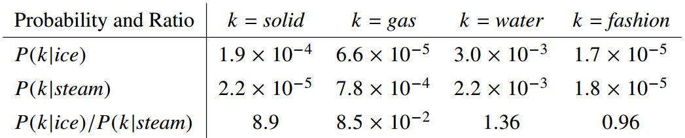
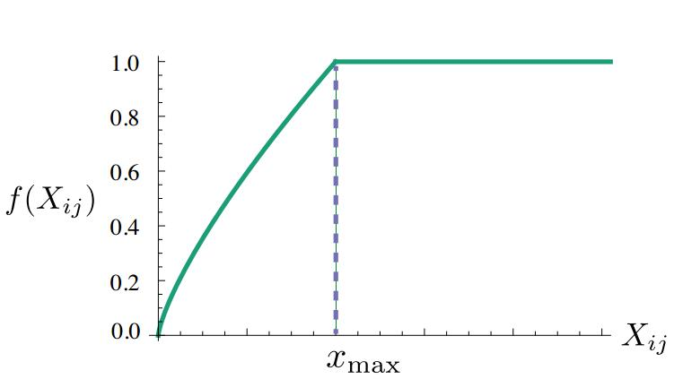

<head>
    <script src="https://cdn.mathjax.org/mathjax/latest/MathJax.js?config=TeX-AMS-MML_HTMLorMML" type="text/javascript"></script>
    <script type="text/x-mathjax-config">
        MathJax.Hub.Config({
            tex2jax: {
            skipTags: ['script', 'noscript', 'style', 'textarea', 'pre'],
            inlineMath: [['$','$']]
            }
        });
    </script>
</head>

# GloVe and Word Senses

[TOC]

---

## 1. GloVe: Global Vectors for Word Representation

### 1. 之前的词向量方法

1. Matrix Factorization Methods
global matrix factorization(全局的矩阵分解)
基于共现矩阵的方法：首先获取所有单词间的共现矩阵(co-occurrence)，然后使用奇异值分解(SVD)进行降维得到词向量

> 优点：可以利用全局的统计信息(golbal statistical information)
> 缺点：在单词类别任务(word analogy)上表现很差，即无法有效地捕捉单词间的语义关系

基于矩阵分解的方法都是使用了**低秩近似low-rank approximations**的原理来分解大的矩阵来获取语料中的统计信息，不过不同的方法中矩阵的形式是不同的，如在latent semantic analysis (LSA)中，矩阵是"term-doucment"的形式。

2. Shallow Window-Based Methods
local context window(局部窗口)来预测单词
Mikolov论文中提出的skip-gram和continuous bag-of-words利用上下文和中心词关系来学习词向量，这些向量可以学习到语言模式(linguistic patterns)和单词向量间的线性关系(linear relationships between word vectors)，这里语言模式可以包含句法和语义(syntasitc and semantic)。

>优点：在单词类别任务中表现良好，即可以有效地捕捉单词的语义，换言之就是在单词空间中可以包含有语义信息的子结构
>缺点：模型是通过遍历语料的形式来学习词向量，无法利用全局的语料统计信息

### 2. GloVe模型

之前的两种方法各有利弊，所以GloVe模型是结合其各自的优点得出的
思路：

- 通过直接在**共现矩阵**上计算来利用语料的全局统计信息
- 直接计算**上下文的相关概率**来实现利用局部上下文信息

global log-bilinear regression(全局对数双线性回归)

符号声明：
>$X$表示单词的共现矩阵或计数(word-word co-occurrence counts)
$X_{ij}$代表单词$j$出现在单词$i$上下文中的次数
$X_i = \sum_k X_{ik}$代表任意单词$k$出现在单词$i$上下文中的次数总和
$P_{ij}=P(j \mid i)=\frac{X_{ij}}{X_i}$是单词$j$出现在单词$i$上下文中的概率

**步骤：**
(1) 使用共现概率的比率来描述该模型
Glove模型认为使用共现概率的比值比直接使用共现概率的效果好，具体看原文中ice和steam概率和比率的表格1如下：

使用下面的公式来表示共现概率的比值：
$$
F\left(w_{i}, w_{j}, \tilde{w}_{k}\right)=\frac{P_{i k}}{P_{j k}} \tag{1}
$$
其中$w \in R^d$是词向量，$\tilde{w} \in R^d$是**分开的上下文词向量**，即上述3个词向量来自于两个词嵌入矩阵，等号右边是直接更加共现矩阵求得的，$P_{i k}$和$P_{j k}$分别是在中心词为$i$和$j$时上下文是$k$的概率。
(2)确定函数$F$的形式
$F$函数为了为了在词向量空间表示出比率$P_{i k}/P_{j k}$，$w_i$和$w_j$做差，然后与$\tilde{w}$做内积，这种方式可以更好体现函数$F$的线性，并且更好将词向量各个维度对应起来，公式如下：
$$
F\left(\left(w_{i}-w_{j}\right)^{T} \tilde{w}_{k}\right)=\frac{P_{i k}}{P_{j k}} \tag{2}
$$
在语料中每一个词即可以是中心词也可以是上下文，所以单词共现矩阵$X$是对称矩阵的，因此模型需要保证各个词向量是可交换的，函数$F$是同态的([homomorphism](https://zh.wikipedia.org/wiki/%E5%90%8C%E6%80%81))，得到如下公式(3)：
同态满足下面性质：
```
f(a + b) = f(a) + f(b)
f(a + b) = f(a) * f(b)
```
$\color{red}{仍有疑问}$，公式(3)怎么得出的
$$
F\left(\left(w_{i}-w_{j}\right)^{T} \tilde{w}_{k}\right)=\frac{F\left(w_{i}^{T} \tilde{w}_{k}\right)}{F\left(w_{j}^{T} \tilde{w}_{k}\right)} \tag{3}
$$
根据公式(2)得下面公式：
$$
F\left(w_{i}^{T} \tilde{w}_{k}\right)=P_{i k}=\frac{X_{i k}}{X_{i}} \tag{4}
$$
则公式(3)的解为$F=exp()$：
$$
w_{i}^{T} \tilde{w}_{k}=\log \left(P_{i k}\right)=\log \left(X_{i k}\right)-\log \left(X_{i}\right) \tag{5}
$$
上述公式中$log(X_i)$的存在破坏了可交换对称性(exchange symmetry)，但该项是独立于$k$的，所以使用下面的公式来实现可交换对称：
$$
w_{i}^{T} \tilde{w}_{k}+b_{i}+\tilde{b}_{k}=\log \left(X_{i k}\right) \tag{6}
$$
其中$b_i$与$log(X_i)$等价，$\tilde{b}_k$的存在是为了保证$\tilde{w}$的对称性，因此交换$i$和$k$的值，上述公式的结果完全不变。
(3)确定损失函数形式
在公式(6)中存在两个问题：
1. 当$X_{ij}=0$时函数是无意义的，但在实际中存在大量的词直接是没有共现关系的，因此等于0的现象大量存在，可以考虑给它加个1：$log(X_{ik}) \rightarrow log(1+X_{ik})$
2. 该公式中所有的共现的结果视为相同的(weights all co-occurrences equally)
实际中有的单词间共现很少甚至没有，所以每个共现都应该使用不同的权重

综上得到下面公式：
$$
J=\sum_{i, j=1}^{V} f\left(X_{i j}\right)\left(w_{i}^{T} \tilde{w}_{j}+b_{i}+\tilde{b}_{j}-\log X_{i j}\right)^{2} \tag{7}
$$
其中$V$是字典的大小，上述公式中损失函数趋于使公式(6)的结果成立，权重函数$f$满足下面的属性：
1. $f(0)=0$，保证在单词共现计数为0时不会产生损失
2. $f(x)$应该是非减函数，这样共现的低频词的权重不会偏大(rare co-occurrences are not overweighted)
3. $f(x)$对于大的共现计数应该相对较小，为了防止高频词的权重过大( frequent co-occurrences are not overweighted)

这里的$f(x)$的形式如下：

$$
f(x)=\left\{\begin{array}{cl}{\left(x / x_{\max }\right)^{\alpha}} & {\text { if } x<x_{\max }} \\ {1} & {\text { otherwise }}\end{array}\right. \tag{8}
$$
这里的$\alpha$取$3/4$，这个值与负采样论文中用一元模型的指数一样，$x_{max}=100$。

### 3. 模型关系

所有无监督的词向量学习方法都是基于语料的共现特性的，所以模型间应该有一定的共性
在skip-gram模型中，单词$j$出现在单词$i$的上下文中的预测概率使用下面式子：
$$
Q_{i j}=\frac{\exp \left(w_{i}^{T} \tilde{w}_{j}\right)}{\sum_{k=1}^{V} \exp \left(w_{i}^{T} \tilde{w}_{k}\right)} \tag{9}
$$
使用词向量点积然后归一化的方式来计算上下文中某个词的概率，所以目标函数就是最大化所有的上下文概率，方法就是将所有词的上下文概率相乘，然后求最大值，一般取负对数变为求和，公式如下：
$$
J=-\sum_{i \in \text { corpus } \atop j \in \operatorname{context}(i)} \log Q_{i j} \tag{10}
$$
上面公式中归一化分母计算量很大，$\color{red}{skip-gram中会引入近似的值}$，该模型需要按顺序遍历语料，所以训练的效率很低，可以直接统计所有的单词共现次数，将公式(10)转换为下面的形式：
$$
J=-\sum_{i=1}^{V} \sum_{j=1}^{V} X_{i j} \log Q_{i j} \tag{11}
$$
当两个单词没有出现共现时$X_{ij}=0$，所以不会产生损失，只对存在上下文共现关系的词计算损失，这样和公式(10)实现的作用是相同的。
根据$X_{i}=\sum_{k} X_{i k}$和$P_{i j}=X_{i j} / X_{i}$将公式(11)转换为下面的形式：
$$
J=-\sum_{i=1}^{V} X_{i} \sum_{j=1}^{V} P_{i j} \log Q_{i j}=\sum_{i=1}^{V} X_{i} H\left(P_{i}, Q_{i}\right) \tag{12}
$$
其中$H\left(P_{i}, Q_{i}\right)$是$P_i$和$Q_i$的交叉熵，$P_i$是通过共现矩阵计算得到的，可以当作真实的分布，$Q_i$是通过词向量计算的是预测分布。
公式(12)中还存在两个问题：
1. 模型为所有单词都分配相同的权重，一些不可能事件(unlikely events)，即没有共现的单词也参与了计算
2. $Q$还需要归一化才行，计算量很大

解决方法：**每个分布加个权重** + **最小二乘目标函数**(不需要归一化)
结果如下：
$$
\hat{J}=\sum_{i, j} X_{i}\left(\hat{P}_{i j}-\hat{Q}_{i j}\right)^{2} \tag{13}
$$
其中$\hat{P}_{i j}=X_{i j}$，$\hat{Q}_{i j}=\exp \left(w_{i}^{T} \tilde{w}_{j}\right)$，这两个都是未归一化的分布，但是$X_{ij}$值很大，所以需要加个对数操作来降低值的量级：
$$
\begin{aligned} \hat{J} &=\sum_{i, j} X_{i}\left(\log \hat{P}_{i j}-\log \hat{Q}_{i j}\right)^{2} \\ &=\sum_{i, j} X_{i}\left(w_{i}^{T} \tilde{w}_{j}-\log X_{i j}\right)^{2} \end{aligned} \tag{14}
$$
在上面的公式中权重$X_i$是遍历语料计算共现次数得到的，因此高频词的共现计数会很大，低频词的会很小，在负采样论文中对高频词进行子采样(subsampling)来减少高频词的使用频率，可以提高性能，因此这里将权重$X_i$参数化会更合理，公式如下：
$$
\hat{J}=\sum_{i, j} f\left(X_{i j}\right)\left(w_{i}^{T} \tilde{w}_{j}-\log X_{i j}\right)^{2} \tag{15}
$$
这里得到的公式(15)和前面推理得到的公式(7)是等价的，当然偏置也可以包含到公式(15)中。

总结：
1. GloVe使用共现矩阵计算共现概率的比率，通过优化这个比率来得到词向量，使用共现矩阵可以利用全局的共现统计信息，这里使用了基于矩阵分解的方法(LSA)的优点；**优化共现概率比率**相当于优化局部上下文的概率，这里使用了基于局部窗口的方法(skip-gram)中的优点，所以GloVe效果更好。
2. 使用最小二乘的目标函数来衡量两个分布的距离，省去了交叉熵中归一化的巨大的计算量
3. 为共现单词安排不同的权重，虽然这个权重没有归一化，但值属于[0,1]，权重表示上下文中每个单词对中心词的影响是不同的，有点attention的感觉，需要注意的是当两个单词不共现时权重为0，即不计入最终的损失。
4. 在共现矩阵$X$中，每个单词属于中心词也属于上下文，所以该矩阵是对称的，模型需要满足$\color{red}{同态性}$，交换两个变量对结果不会产生影响。

## 2. Improving Distributional Similarity with Lessons Learned from Word Embeddings

核心观点：**word embeddings词向量在word similarity和analogy任务上比count-based的算法表现更好，这是在特定的任务和超参数的调优上导致的，而不是词嵌入算法本身的优势，在count-based算法上也进行调优，可以在某些任务上超过词嵌入的性能**。

测试任务：word similarity + analogy detection

已有方法：
|class|method1|method2|
|-|-|-|
|count-based|explicit PPMI matrix(正点互信息矩阵)|SVD factorization(共现矩阵奇异值分解)|
|prediction-based|SGNS(skip-gram负采样)|GloVe(单词共现概率比值)|

符号声明：
>$w \in V_W$表示中心词
$c \in V_C$表示上下文
$V_W$和$V_C$表示中心词和上下文的字典
$D$表示中心词-上下文对(word-context pairs)
$\#(w,c)$表示该word-context对出现的次数
$\#(w) = \sum_{c^{\prime} \in V_{C}} \#\left(w, c^{\prime}\right)$是$c$出现在$D$中的次数
$\#(c) = \sum_{w^{\prime} \in V_{W}} \#\left(w^{\prime}, c\right)$是$w$出现在$D$中的次数

所有为了更好地计算相似度而向量**归一化**
#### (1) PMI点互信息
传统方法中定义稀疏矩阵$M$，也称为共现矩阵，行是中心词$w$，列时上下文$c$，$M_{ij}$表示了单词$w_i$和上下文$c_j$的关系，使用点互信息pointwise mutual information(PMI)来表示共现的关系。
PMI定义为$w$和$c$的**联合概率与边缘概率的比值**，如下：
$$
PMI(w, c)=\log \frac{\hat{P}(w, c)}{\hat{P}(w) \hat{P}(c)}=\log \frac{\#(w, c) \cdot|D|}{\#(w) : \#(c)} \tag{1}
$$

当共现为0时直接设置$PMI(w,c)=0$得到矩阵$M_0^{PMI}$，也可以使用positive PMI(PPMI)，将PMI为负的值都取0得到$M^{PPMI}$，但这两个矩阵都在低频词上存在偏置，低频词使式子(1)中分母很小，从而增大PMI值。

#### (2) 奇异值分解(Singular Value Decomposition, SVD)

将矩阵$M$进行分解，只保留前$d$个奇异值：
$$
M_{d}=U_{d} \cdot \Sigma_{d} \cdot V_{d}^{\top} \tag{2}
$$
词向量和上下文如下：
$$
W^{\mathrm{SVD}}=U_{d} \cdot \Sigma_{d} \quad C^{\mathrm{SVD}}=V_{d} \tag{3}
$$
$W=U_{d} \cdot \Sigma_{d}$和上述$M_d$各自行的**内积是相同的**，对PPMI矩阵进行SVD分解也可以得到词向量。

#### (3) Skip-Grams with Negative Sampling (SGNS)

SGNS可以看做**隐式分解PMI**，但加了个偏置log(k)
$$
W \cdot C^{\top}=M^{\mathrm{PMI}}-\log k \tag{4}
$$

#### (4) GloVe

词向量的优化目标：
$$
\vec{w} \cdot \vec{c}+b_{w}+b_{c}=\log (\#(w, c)) \quad \forall(w, c) \in D \tag{5}
$$
GloVe 在$b_w=log\#(w)$和$b_c=log\#(c)$时， 也是在**分解PMI**，但偏置为log(D)，D为单词对(w,c)的个数
$$
M^{\log (\#(w, c))} \approx W \cdot C^{\top}+\overrightarrow{b^{\vec{w}}}+\overrightarrow{b^{c}} \tag{6}
$$

GloVe使用调和函数来给上下文加权，word2vec使用与中心词的距离为上下文加权(dynamic context window, dyn)

word2vec 子采样在生成词对前，这样相当于增加了某些单词的滑窗大小，可以看到L大小外的单词，这称为dirty，如果是在生成词对后再扔掉高频词，这样为clean，但两种方法效果差不多

负采样使用平滑的**一元模型**，使用3/4作为指数，这个提高了稀有词汇c(低频词)的采样概率，同时减少与稀有词会共现的中心词W的PMI？

输出词向量：相加或只使用一个，性能表现与具体的方法有关
> 有时选择合适的超参数比选择合适算法重要,embiddings方法不一定一致的比count-based的方法好，调节好超参数甚至比在更多的数据上得到的效果好

GloVe竟然没有SGNS(skip-gram + negative sampling)效果好；SGNS比PPMI的在类比analogy任务上好

使用相似性乘积比相似性求和好

结合上下文窗口的每个单词可以得到更好的上下文词向量，但实践中没有实现，有待研究

SVD中使用PPMI加偏置使其性能变差；直接使用分解后的奇异向量会使效果变差，即使对奇异向量加权可以提高性能

总结：

1. PPMI与SVD方法使用小的上下文滑窗，SGNS使用多个负样本效果更好
2. SVD方法使用两个向量和效果比只使用一个的差
3. 上下文分布平滑(context distribution smoothing)可以频繁使用，0.75的指数在大多任务中表现良好，在PPMI上的提升最显著，因为它减少了在稀有词汇(低频词)的相对影响
4. 实践总结

- 多使用context distribution smoothing来修改PMI来提高性能
- 对SVD的奇异向量要加权，即使用0或0.5的指数
- SGNS在大多任务中表现有鲁棒性robust，$\color{red}{这里说它的速度最快，但GloVe论文说自己快，谁对？}$