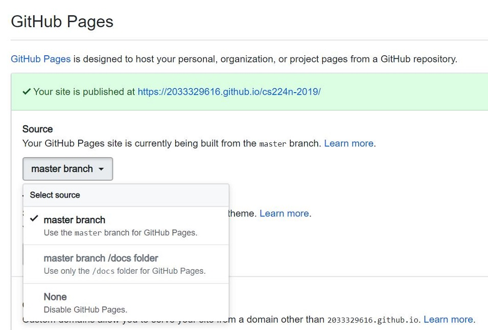

在github中markdown文件里用$括起来书写的公式无法直接显示，所以这里将markdown转换为html文件，然后再调用GitPage来解析该网页，最终显示完整的文档。
## 1.首先配置github的仓库
打开仓库的settings选项，再找到GitHub Pages设置中的Source，然后设置为master branch，结果如下图所示：



## 2.设置_config.yml文件
通常在GitHub Pages使用change theme后会自动在主目录下生成该文件，如果没有该文件，手动在仓库的主目录创建一个，填写下面的内容：
```markdown
theme: jekyll-theme-cayman
markdown: kramdown
```

### 3. 在markdown最上面插入\<head>声明

```markdown
<head>
    <script src="https://cdn.mathjax.org/mathjax/latest/MathJax.js?config=TeX-AMS-MML_HTMLorMML" type="text/javascript"></script>
    <script type="text/x-mathjax-config">
        MathJax.Hub.Config({
            tex2jax: {
            skipTags: ['script', 'noscript', 'style', 'textarea', 'pre'],
            inlineMath: [['$','$']]
            }
        });
    </script>
</head>
```

这里的markdown是使用VS code编写，然后在`Markdown Preview Enhanced`插件生成的预览文件中右键选择HTML选项里的`cdn hosted`选项，生成html文件

### 4.使用github io来解析html文件
将得到的html文件传到github上后，直接点击会显示html源文件，所以需要通过github io来解析得到网页，使用下面的格式来访问：

```markdown
https://user_name.github.io/repository_name/blog_name.html
```
注意当html文件没有在根目录时，只要添加html的完整路径就可以解析

参考：[让GitHub Page支持Latex公式](https://zhuanlan.zhihu.com/p/36302775)