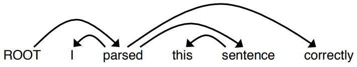

<head>
    
    
</head>

# CS224n Assignment3 Dependency Parsing

### 1. Machine Learning & Neural Networks

(a) Adam Optimizer

1. Adam中使用**momentum动量**机制，使梯度可以更好地更新
$$
\begin{array}{l}{\mathbf{m} \leftarrow \beta_{1} \mathbf{m}+\left(1-\beta_{1}\right) \nabla_{\boldsymbol{\theta}} J_{\text { minibatch }}(\boldsymbol{\theta})} \\ {\boldsymbol{\theta} \leftarrow \boldsymbol{\theta}-\alpha \mathbf{m}}\end{array}\tag{1}
$$
在上面的式子中对梯度进行了滑动平均处理(可以理解为低通滤波器)，当$\beta_1=0$时表示完全抛弃旧的梯度信息，只使用新的梯度信息，当$\beta_1=1$时，只使用旧的梯度信息，将新的梯度信息完全抛弃，当该超参数在$(0,1)$时可以有效地控制旧梯度和新梯度的比值，**动量会利用先前的梯度信息跳过局部最小值**，从而更有效地影响最终参数的更新。
1. Adam中使用**adaptive learning rates**来针对梯度动态地调整学习率
$$
\begin{array}{l}{\mathbf{m} \leftarrow \beta_{1} \mathbf{m}+\left(1-\beta_{1}\right) \nabla_{\boldsymbol{\theta}} J_{\text { minibatch }}(\boldsymbol{\theta})} \\ {\mathbf{v} \leftarrow \beta_{2} \mathbf{v}+\left(1-\beta_{2}\right)\left(\nabla_{\boldsymbol{\theta}} J_{\text { minibatch }}(\boldsymbol{\theta}) \odot \nabla_{\boldsymbol{\theta}} J_{\text { minibatch }}(\boldsymbol{\theta})\right)} \\ {\boldsymbol{\theta} \leftarrow \boldsymbol{\theta}-\alpha \odot \mathbf{m} / \sqrt{\mathbf{v}}}\end{array} \tag{2}
$$
注意$m$和$v$都使用了滑动平均(rolling average)，在更新参数时使用$\mathbf{m} / \sqrt{\mathbf{v}}$，在按元素相除中，相当于梯度张量中每个元素都对自己进行了标准化，但由于分子和分母不是相同的，所以保留了待更新的信息，每个元素标准化，这样所有梯度更新量就会趋于一致，**更大的梯度会使用较小的更新量，更小的梯度使用较大的更新量(相比于之前的更新量)**，因此不会存在大幅的差异，有利于参数的更新。

(b) Dropout
正则化(regularization)方法来防止在训练集上过拟合
dropout公式为：
$$
\mathbf{h}_{\text{drop}}=\gamma \mathbf{d} \circ \mathbf{h}\tag{3}
$$
其中$\mathbf{d} \in \{ 0, 1\}^{D_h}$，$p_{drop}$是$\mathbf{d}$为0的概率，$1-p_{drop}$是$\mathbf{d}$为1的概率

1. 选择$\gamma$使$\mathbf{h}_{\mathbf{drop}}$的期望为$\mathbf{h}$
离散型随机变量的期望：
$$
E_x=\sum_i^NP(x_i)*x_i \tag{3}
$$
其中$N$是类别数，$x_i$是对应的随机变量
这里dropout相当于只有两个类，因此：
$$
\begin{aligned}
\mathbb{E}_{p_{\text { drop }}}\left[\mathbf{h}_{\text { drop }}\right]_i &= p_{drop}*\gamma \mathbf{d} * \mathbf{h}_i + (1-p_{drop}) * \gamma \mathbf{d} * \mathbf{h}_i
\\ &= p_{drop}*\gamma *0 * \mathbf{h}_i + (1-p_{drop}) * \gamma *1 * \mathbf{h}_i = \mathbf{h}_i
\end{aligned}
 \tag{4}
$$
因此
$$\gamma=\frac{1}{1-p_{drop}}\tag{5}$$
使上述等式成立
2. 为什么在测试时不是有dropout
如果要在测试时使用dropout，那每次的测试结果就会不同，但模型应该具有一致性才行，所以为了不引入随机性，在测试时关闭dropout，但要保证**测试时模型输出的期望与训练时一致**，具体的做法是在测试阶段将输出进行缩放，或者在训练时将输出乘inverted dropout，这样测试时输出就不用改变了。

### 2. Neural Transition-Based Dependency Parsing

基于神经网络的的依存分析(dependency parser)器，可以捕捉句子的语法结构，并且发现单词间的关系，找到head words及稀释这些heads的单词

每一步都进行parital parse，使用转换(transition)的方法
- **stack**：存放ROOT节点，和其他正在处理的单词
- **buffer**：存放将要处理的单词
- **list of dependencies**：存放已经得到的依存结构
3种转换为：
- SHIFT：将buffer的第一个单词放到stack中
- LEFT-ARC：$second\_term \leftarrow first\_term$，将$second\_term$移除
- RIGHT-ARC：$second\_term \rightarrow first\_term$，将$first\_term$移除(将箭头所指的单词移除)

**每一个step中使用神经网络分类器决定使用3个转换种的哪个转换**

(a) 分析句子stack和buffer的配置
示例句子的dependency tree如下：

在每个时刻stack和buffer等的配置为：
|Stack|Buffer|New dependency|Transition|
|-|-|-|-|
|[ROOT]                          |   [I, parsed, this, sentence, correctly]  ||Initial Configuration|
|[ROOT,I]                        |   [parsed, this, sentence, correctly]     |      |SHFIT|
|[ROOT, I, parsed]               |   [this, sentence, correctly]             |      |SHFIT|
|[ROOT, parsed]                  |   [this, sentence, correctly]             |parsed$\rightarrow$I| LEFT-ARC|
|[ROOT, parsed, this]            |   [sentence, correctly]                   |      |SHIFT|
|[ROOT, parsed, this, sentence]  |   [correctly]                             |      |SHIFT|
|[ROOT, parsed, sentence]        |   [correctly]                             |this$\leftarrow$sentence|LEFT-ARC|
|[ROOT, parsed]                  |   [correctly]                         |parsed$\rightarrow$sentence|RIGHT-ARC|
|[ROOT, parsed, correctly]       |   []                                  ||SHIFT|
|[ROOT, parsed]                  |   []                                  |parsed$\rightarrow$correctly|RIGHT-ARC|
|[ROOT]                  |   []                                  |ROOT$\rightarrow$parsed|RIGHT-ARC|

(b) 一个有$n$个单词的句子，需要处理多少步？
一共需要$2n$步，首先单词需要$shift$进入stack，这里面需要$n$次，然后组成的n个单词对需要进行left-arc或right-arc将单词移出stack共需要$n$次，所以共$2n$次操作

(c) code

(d) 